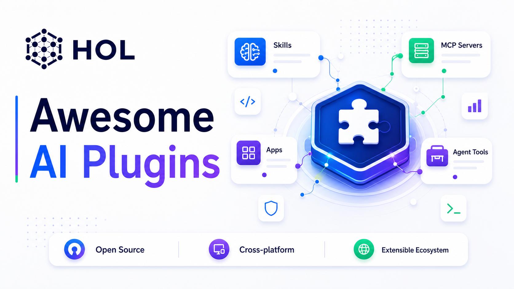

<p align="center">
  <br>
  
  <br>
</p>

<h1 align="center">Awesome AI Plugins</h1>

<p align="center">A curated, cross-platform list of plugins, skills, MCP servers, apps, and agent tools for AI assistants.</p>

<p align="center">
  <a href="https://hol.org/registry/plugins">
    
  </a>
</p>

<p align="center">
  <a href="#contributing"></a>
  <a href="https://opensource.org/licenses/Apache-2.0"></a>
  <a href="https://hol.org/registry/plugins"></a>
  <a href="https://github.com/sponsors/hashgraph-online"></a>
</p>

<p align="center">
  Discover extensions for Codex, ChatGPT, Claude Code, Gemini CLI, Grok, Kimi, DeepSeek Harness, Cursor, OpenCode, and other compatible AI assistants from one community-maintained catalog.
</p>

<p align="center">
  Listings may target one assistant, several assistants, or open standards such as Agent Skills and MCP. Check each project for its supported clients and installation instructions.
</p>

<br>

## Contents

- [Start Here](#start-here)
- [Official Plugins](#official-plugins)
- [Community Plugins](#community-plugins)
  - [Grok Plugins](#grok-plugins)
  - [Kimi Plugins](#kimi-plugins)
  - [DeepSeek Harness Plugins](#deepseek-harness-plugins)
- [Formats & Development](#formats--development)
- [Guides & Articles](#guides--articles)
- [Related Projects](#related-projects)
- [Claim Your Plugin](#claim-your-plugin)
- [Plugin Trust Scores](#plugin-trust-scores)
- [Plugin Quality](#plugin-quality)
- [Contributing](#contributing)
---

## Start Here

New extension workflow:

1. Choose the clients and open formats you support
2. Build the plugin, skill, MCP server, app, or agent tool
3. **Validate with [`plugin-scanner`](https://github.com/hashgraph-online/hol-guard)** — recommended local preflight
4. **Add the [HOL scanner GitHub Action](https://github.com/hashgraph-online/ai-plugin-scanner-action)** — recommended for security, optional for listing
5. Ship or submit with confidence

### Quick preflight

```bash
pipx run plugin-scanner lint .
pipx run plugin-scanner verify .
```

### Scanner CI (recommended for security)

Scanner CI is optional for listing. HOL still scans listed projects independently. We recommend including it so MCP servers, skills, plugins, and other agent extensions stay continuously checked — that is how this catalog stays safer for everyone who installs from it. Projects that maintain scanner CI receive the full trust score; projects without it remain eligible and receive a 10% trust-score reduction.

See the full guide: [`SCANNER_GUIDE.md`](./SCANNER_GUIDE.md)  
See contributing requirements: [`CONTRIBUTING.md`](./CONTRIBUTING.md)

The README is the human-readable cross-platform catalog. Machine-readable compatibility exports are available in `plugins.json` and `.agents/plugins/marketplace.json` for registry and automation consumers.

### Browse the catalog

Browse the sections below or use the searchable [HOL Plugin Registry](https://hol.org/registry/plugins). Installation varies by client and project, so follow the linked project's setup guide.

This repository is a discovery catalog, not a universal installer. Follow each linked project's instructions for the clients and formats it supports.

## Official Plugins

- [mblode/agent-skills](https://github.com/mblode/agent-skills) - Nobody ships AI slop on purpose. These skills make sure you don't. UI audits, typography, docs, PR review, and releases.

<details>
<summary>Curated by OpenAI — available in the built-in Codex Plugin Directory</summary>

- Box - Access and manage files.
- Cloudflare - Manage Workers, Pages, DNS, and infrastructure.
- Figma - Inspect designs, extract specs, and document components.
- GitHub - Review changes, manage issues, and interact with repositories.
- Gmail - Read, search, and compose emails.
- Google Drive - Edit and manage files in Google Drive.
- Hugging Face - Browse models, datasets, and spaces.
- Linear - Create and manage issues, projects, and workflows.
- Notion - Create and edit pages, databases, and content.
- Sentry - Monitor errors, triage issues, and track performance.
- Slack - Send messages, search channels, manage conversations.
- Vercel - Deploy, preview, and manage Vercel projects.

</details>

## Community Plugins

Third-party plugins built by the community. [PRs welcome](#contributing)!

### Development & Workflow

<!-- pinned -->
- [geml](https://github.com/geml-spec/geml) - An agent-native markup language featuring deterministic block-level editing and built-in validation to ensure documents never drift or break during AI operations.
- [2718lab DevKit](https://github.com/2718labs/2718lab-devkit) - Codex-first local MCP server and skill bundle for deterministic project intelligence, durable workflow orchestration, and reusable engineering tools.
- [A Team](https://github.com/RBraga01/a-team) - Universal multi-agent infrastructure with 25 specialist agents, 16 enforced workflow skills, and a lead orchestrator for Claude Code, Codex CLI, Cursor, and OpenCode.
- [Aegis](https://github.com/GanyuanRan/Aegis) - An agentic skills framework & software development methodology that works: planning, TDD, debugging, and collaboration workflows.
- [Agent Context OS](https://github.com/conorbronsdon/agent-context-os) - Portable Git-backed context and session workflow layer with first-class Claude Code, Codex, and OpenClaw support.
- [Agent Deck](https://github.com/not-so-fat/agent-deck) - One MCP for context management: bind self-improving playbooks, MCP tools, and API keys to the session.
- [Agent Guard](https://github.com/JeongJaeSoon/agent-guard) - Real-time secret-leak guardrails for AI coding agents (Claude Code, Codex), Git hooks, and CI.
- [Agent Workflow System](https://github.com/1139030773-cmd/agent-workflow-system) - Chinese AI workflow system with collaborative skills, behavioral rules, and session recovery for Codex and Claude Code.
- [AgentBridge](https://github.com/raysonmeng/agent-bridge) - Local bidirectional bridge that keeps Claude Code and Codex live as peers in one session.
- [Agentic Ship](https://github.com/moasq/agentic-ship) - Cross-host product-development toolkit for Claude Code, Codex, Cursor, Hermes, and OpenClaw.
- [AgentOps](https://github.com/boshu2/agentops) - DevOps layer for coding agents with flow, feedback, and memory.
- [AgiFlow](https://github.com/AgiFlow/ai-plugin) - Project management workflows for AI coding agents with planning, grooming, task execution, review, and MCP integration.
- [AI-Native SDLC](https://github.com/bashebr/ai-native-sdlc) - Reusable workflow bundle implementing plan, design, build, test, deploy, and maintain with approval gates.
- [Agnostic-AI](https://github.com/ucsandman/Agnostic-AI) - Apply one Claude Code or Codex harness across Gemini CLI, Cursor, Antigravity, and more clients.
- [aide](https://github.com/jmylchreest/aide) - Persistent memory, code intelligence, and multi-agent orchestration for Claude Code, OpenCode, and Codex CLI.
- [Alcove](https://github.com/epicsagas/alcove) - Local-first MCP server for private project docs with hybrid search, code indexing, and linting.
- [Alloy](https://github.com/tlangridge/Alloy) - Orchestrates Codex, Claude, Grok, and Antigravity CLIs with Jev task routing and managed worktrees.
- [Anchor](https://github.com/biefan/anchor) - Engineering discipline pack for Claude Code and Codex CLI with task-scope locking and review gates.
- [ArmorCodex](https://github.com/armoriq/armorCodex) - Intent-based security for Codex with MCP plan registration, policy gating, and audit logging.
- [Browser Harness](https://github.com/browser-use/browser-harness) - MCP server and agent skill connecting an AI agent to a real browser.
- [Casefile](https://github.com/x4cc3/casefile) - Persistent security case tracking for bug bounties, CTFs, and security audits.
- [Claude Code for Codex](https://github.com/sendbird/cc-plugin-codex) - Use Claude Code from Codex for reviews, rescue tasks, and tracked background jobs.
- [Codex Reviewer](https://github.com/schuettc/codex-reviewer) - Second-pass review of Claude-driven plans and implementations.
- [Context Guard](https://github.com/GreenLv/codex-context-guard) - Preserves requirements and verification evidence across long-running Codex tasks.
- [Groundwork](https://github.com/etr/groundwork) - Skills library for discovery, planning, design, TDD, debugging, validation, and shipping.
- [Hera Agent Godot](https://github.com/NotNull92/hera-agent-godot) - Drives a live Godot editor through a low-token CLI with runtime QA.
- [HOL Guard Plugin](https://github.com/hashgraph-online/hol-guard-plugin) - AI antivirus workflow for Codex, Claude Code, Cursor, Gemini, OpenCode, MCP servers, and skills.
- [Jev Browser](https://github.com/jkudish/jev-browser) - Fast, cheap browser use for agents with an auditable step trace and screenshot.
- [Jev Go](https://github.com/nandansrikrishna/jev-go) - Standalone Go CLI and MCP server for TypeSafe's Jev model.
- [Jev MCP](https://github.com/jkudish/jev-mcp) - Fast typed judgments for agents with probabilities and confidence.
- [Jev Studio](https://github.com/utk2103/jev-studio) - Toolkit for TypeSafe's Jev with MCP tools and prompt libraries.
- [jev-harness](https://github.com/AntonioCoppe/jev-harness) - Decision harness for TypeSafe Jev with confidence gates and eval CLI.
- [jev-preflight](https://github.com/muse0509/jev-preflight) - Claude Code plugin using TypeSafe's Jev to assess code-change risk.
- [jev-use](https://github.com/shitianfang/jev-use) - Routes steps that need no text output to Jev's judgment model across Claude Code, Codex, and Pi.
- [Jevbridge](https://github.com/tacticocc/Jevbridge) - OSS ACP/MCP adapter that bridges TypeSafe Jev with any LLM, putting computer use and typed decisions alongside Codex, Claude, Grok, and OpenCode without replacing those hosts.
- [jevcheck](https://github.com/sathariels/jevcheck) - Model-upgrade contract CLI for TypeSafe Jev (fixture eval, record/compare, CI-friendly exits); `pip install jevcheck`.
- [JevPromptCoach](https://github.com/CrowdLinker/JevPromptCoach) - Claude Code plugin that scores how well you prompt a coding agent using TypeSafe's Jev model.
- [JevScout](https://github.com/hqman/JevScout) - Autonomous job hunt orchestrator powered by TypeSafe Jev and Chrome DevTools Protocol.
- [Jump Skills](https://github.com/fabricioctelles/jump-skills) - Meta-skills routing requests to specialized skills across agent hosts.
- [keep-the-why](https://github.com/oliver-zehentleitner/keep-the-why) - Preserves the reasoning behind a codebase as project memory.
- [Kernel](https://github.com/ariaxhan/kernel-claude) - Claude Code marketplace and Codex plugin with guarded workflows and durable memory.
- [Knowl](https://github.com/dat999zx/knowl) - Local-first project memory over MCP for Claude Code, Codex, Cursor, and other hosts.
- [Metis](https://github.com/gkrtjd99/Metis) - Repository-level engineering orchestrator with evidence-gated completion.
- [Open Dynamic Workflows](https://github.com/Suraj1235/open-dynamic-workflows) - Local-first dynamic multi-agent workflows for Codex, OpenCode, Antigravity, Cursor, and VS Code.
- [OpenCode Orchestrator](https://github.com/agnusdei1207/opencode-orchestrator) - Multi-agent mission control for OpenCode.
- [Planning with Files](https://github.com/OthmanAdi/planning-with-files) - Persistent file-based planning for Claude Code, Codex, and other AI coding agents.
- [Praxis](https://github.com/ouonet/praxis) - Intent-driven workflow skills for coding agents.
- [Repo Audit](https://github.com/conorbronsdon/repo-audit) - Agent Skill checking whether repository documentation matches its code and rules.
- [Session Orchestrator](https://github.com/Kanevry/session-orchestrator) - Session orchestration for Claude Code, Codex, and Cursor IDE.
- [skillsaw](https://github.com/stbenjam/skillsaw) - Configurable linter for agent skills, plugins, and AI coding assistant context.
- [Spec-Driven Development](https://github.com/Habib0x0/spec-driven-plugin) - Requirements, design, tasks, and acceptance workflow for Claude Code and Codex.
- [Staff Engineer Mode](https://github.com/sirmarkz/staff-engineer-mode) - Staff-level specialist guidance for AI coding agents.
- [Tree Ring Memory](https://github.com/TerminallyLazy/tree-ring-memory-codex-plugin) - Local-first memory lifecycle guidance for Codex agents.
- [Unforgit](https://github.com/MiguelMedeiros/unforgit-codex-plugin) - Git-backed repository memory for Codex and other coding agents.
- [Universal Design Principles](https://github.com/HDeibler/universal-design-principles) - Cross-agent UX and product-design marketplace with Agent Skills.
- [Workflow Kit](https://github.com/Le-Xuan-Thang/workflow-kit) - Full product lifecycle plugin for Claude Code, Codex CLI, and OpenCode.

### Tools & Integrations

- [Agent Message Queue](https://github.com/avivsinai/agent-message-queue) - File-based inter-agent messaging with federation and orchestrator integrations.
- [AgentCall](https://github.com/pattern-ai-labs/agentcall) - Lets coding agents join Google Meet, Zoom, or Microsoft Teams.
- [AgentGuards](https://github.com/alelaguard/agentguards-plugins) - LLM security guardrails for Codex with hooks and MCP tools.
- [AnyCap](https://github.com/anycap-ai/anycap) - Media generation, analysis, research, file sharing, and page publishing through one CLI and MCP server.
- [Chrome DevTools](https://github.com/win4r/chrome-devtools-codex-plugin) - Codex plugin wrapper for chrome-devtools-mcp.
- [Miro](https://github.com/miroapp/miro-ai) - Official Miro MCP server and agent integrations.
- [Web Search MCP](https://github.com/sydasif/web-search-mcp) - FastMCP server giving agents real-time web access with SSRF-protected URL fetching.
- [You.com Agent Skills](https://github.com/youdotcom-oss/agent-skills) - Cross-platform web search and extraction skills and MCP server configs.

### Grok Plugins

xAI Grok Build plugins can bundle skills, commands, agents, hooks, MCP servers, and language-server configuration. A native plugin may include `.grok-plugin/plugin.json`.

### Kimi Plugins

Kimi Code plugins package skills, agents, and MCP servers for the Kimi runtime.

### DeepSeek Harness Plugins

DeepSeek Harness plugins are Cordis modules or npm packages that expose a `dsh.bundle` manifest.

## Formats & Development

AI extensions use several overlapping formats. Agent Skills provide reusable instructions, MCP servers expose tools and data, DeepSeek Harness loads Cordis modules/npm packages, and client-specific plugin manifests package those capabilities for installation. Prefer open formats where practical, then add client adapters for the assistants you support.

### Getting Started

- [Official Docs: Agent Skills](https://developers.openai.com/codex/skills) - The skill authoring format.
- [Official Docs: Build Plugins](https://developers.openai.com/codex/plugins/build) - Author and package plugins.
- [Plugin Structure](https://developers.openai.com/codex/plugins/build#create-a-plugin-manually) - `.codex-plugin/plugin.json` manifest format.

### Codex-Compatible Plugin Anatomy

```
my-plugin/
├── .codex-plugin/
│   └── plugin.json
├── skills/
│   └── my-skill/
│       └── SKILL.md
└── mcp.json
```

## Validate Before You Ship

After scaffolding with `$plugin-creator`, use [`plugin-scanner`](https://github.com/hashgraph-online/hol-guard) as your quality gate before publishing, review, or distribution.

```bash
pipx run plugin-scanner lint .
pipx run plugin-scanner verify .
```

## Guides & Articles

- [Codex Plugins, Visually Explained](https://adithyan.io/blog/codex-plugins-visual-explainer)
- [OpenAI's Codex Gets Plugins](https://thenewstack.io/openais-codex-gets-plugins/)

## Related Projects

- [Awesome DeepSeek Harness Plugins](https://github.com/awesome-dsh-plugin/awesome-dsh-plugin)
- [awesome-codex-plugins](https://github.com/hashgraph-online/awesome-codex-plugins)
- [HOL Plugin Registry](https://hol.org/registry/plugins)
- [Kimi Code](https://github.com/MoonshotAI/kimi-code)
- [xAI Grok Plugin Marketplace](https://github.com/xai-org/plugin-marketplace)

## Claim Your Plugin

Verify ownership of your plugin on the [HOL Plugin Registry](https://hol.org/registry/plugins) to display a verified badge on your listing.

## Plugin Trust Scores

Every plugin in this list is automatically ingested by the [HOL Plugin Registry](https://hol.org/registry/plugins), which runs each through the [`plugin-scanner`](https://github.com/hashgraph-online/hol-guard) to produce a trust score and security analysis.

## Plugin Quality

If you received a scanner report on your repo, check the [Scanner Guide](SCANNER_GUIDE.md) for setup instructions, common fixes, and CI setup.

## Contributing

Contributions welcome! Please read the [contribution guidelines](CONTRIBUTING.md) first.

To add a plugin:

1. Fork this repo and add a single line to the appropriate section in `README.md` (alphabetical order)
2. Submit a PR with the plugin repo URL. Scanner CI in the source repository is optional for listing and recommended for security.

**You do not need to copy plugin files into this repo.** A generator fetches your bundle from your source repo and regenerates catalog files automatically.
